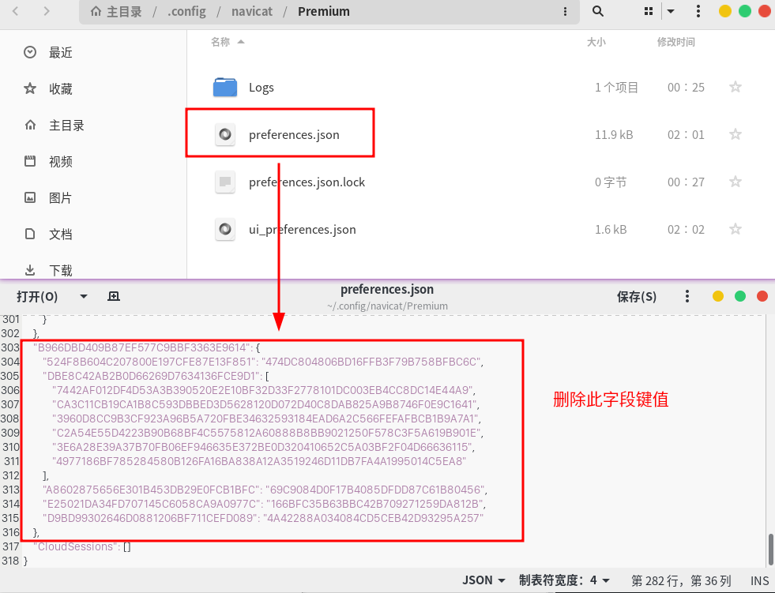
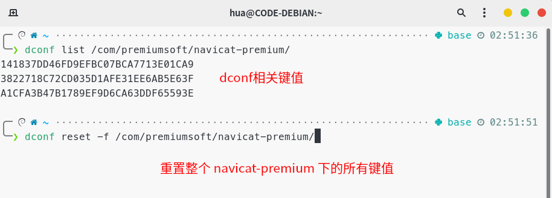

# navicat-premium-linux-reset

该脚本通过删除 `preferences.json` 文件中 `B966DBD409B87EF577C9BBF3363E9614` 字段，dconf 命令重置清除相关键值，来完成 navicat premium 的试用期重置

适用于 Linux 版本 navicat premium 的试用期

- 16.2.5 版本可用 

***navicat premium 其他版本尚未尝试***

> 测试系统：Debian12
> 
> 测试桌面环境：Gnome

## 用法

执行 shell 脚本，或使用 python 命令执行 python 脚本

```shell
# 方式一：执行 shell 脚本
chmod +x reset-navicat.sh
./reset-navicat.sh

# 方式二：python 命令执行 python 脚本
python reset_navicat.py
```

## 用户开机登录后启动脚本

```shell
# 编辑用户目录下的 .profile 文件
vim ~/.profile

# 添加脚本命令
# 例如：bash "$HOME/navicat-premium-linux-reset/reset-navicat.sh"
bash shell脚本路径
```

## 重置 navicat 的思路

### 1、删除json文件中指定字段



### 2、dconf 中需要重置的 navicat 相关的键值

